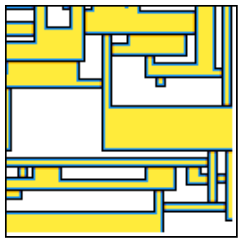

"# WaveFunctionCollapse"   

https://github.com/mxgmn/WaveFunctionCollapse

  
         ↓  

- Call img_url_to_data("test#.png", start) in the browser console, with # = {1,2,3,4}  

- Edit the variables in the script section of index.html for dfference solution  

- Useful Tools:
    https://www.pixilart.com/draw#  
